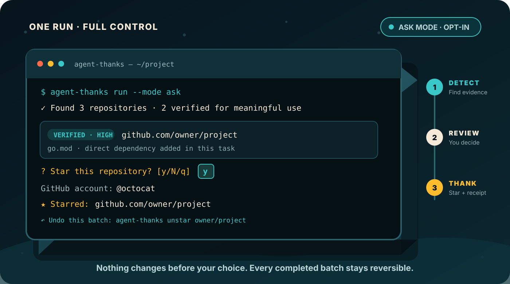

# agent-thanks

[](https://github.com/dbwls99706/agent-thanks/actions/workflows/tests.yml)
[](https://www.python.org/)
[](LICENSE)
<a href="https://smollaunch.com" target="_blank" rel="noopener"></a>

**Find the open-source repositories your coding agent actually used, then thank them with a Star.**

`agent-thanks` turns one AI coding task into a trustworthy shortlist of open-source repositories worth thanking. It checks project changes and coding-agent activity, shows the evidence behind each match, then asks you before every GitHub Star.

The evidence engine is the safety layer. **The product goal is simple: make it easy to notice the open source your agent relied on and leave a visible thank-you.**

<p align="center">
  
</p>

## Install

Recommended with `pipx`:

```bash
pipx install agent-thanks
```

Without `pipx`:

```bash
python -m pip install agent-thanks
```

Then authenticate to GitHub once:

```bash
gh auth login
```

## One command after the coding task

After an AI coding session:

```bash
agent-thanks thanks
```

`thanks` tries to find the newest Claude Code, Codex, or Gemini transcript that belongs to the current project. It combines that activity with the Git diff, writes a report, shows which repositories have verified evidence, and asks whether you want to Star each eligible repository.

If no matching transcript exists, it still scans project changes such as newly declared dependencies and submodules.

Want to see exactly what would happen first?

```bash
agent-thanks thanks --dry-run
```

Typical flow:

```text
AI coding task
      |
      v
find OSS touched by the task
      |
      v
verify evidence
   /      \
verified  review-only
   |          |
   |          +--> shown, never Star-eligible
   v
ask you: Star this repository? [y/N]
      |
      v
final confirmation
      |
      v
GitHub Star
```

No unattended Star mode exists. A Star always requires an interactive terminal and an explicit human decision.

## Try it safely in 30 seconds

Install from PyPI:

```bash
pipx install agent-thanks
```

Then run the built-in demo:

```bash
agent-thanks demo
```

The demo makes no network requests, reads no credentials, writes no files, and changes no Stars.

Example:

```text
[verified | high] https://github.com/BehaviorTree/BehaviorTree.CPP
  - Session ran a repository-use command that completed successfully

[review | low] https://github.com/example/reference-only
  - Repository was referenced in the session; verify actual reuse

Would star: https://github.com/BehaviorTree/BehaviorTree.CPP
```

<p align="center">
  
</p>

## Why the evidence step exists

A coding agent can mention a repository without using it. A clone can fail. A shell command can hide a failure behind `|| true`. A transcript can be incomplete or contradictory.

Automatically Starring every repository URL would make the tool noisy and the Star itself less meaningful. `agent-thanks` therefore separates **finding candidates** from **proving enough to offer a Star**.

A plain URL is a reference. A verified candidate needs stronger evidence.

| Evidence | Result | Star eligible? |
| --- | --- | --- |
| Newly declared direct dependency | Verified use | Yes |
| Clone, submodule, or Git install command with recorded success | Verified use | Yes |
| Explicit provenance statement such as `Adapted from ...` | Verified use | Yes |
| GitHub URL that merely appeared | Review only | No |
| Command with missing, conflicting, or failed result | Review only | No |
| Package that cannot be mapped to a repository | Unresolved | No |

The classifier is deterministic. It does not call another model to decide whether a repository deserves a Star.

## Human-approved means human-approved

For live Stars, `agent-thanks` intentionally makes automation stop before the social action:

- the authenticated GitHub account is shown first,
- existing Stars are detected and skipped,
- each new repository gets its own default-No `y/N` prompt,
- review-only candidates cannot be promoted with a flag,
- there is no approve-all or unattended Star mode,
- a final confirmation is required before mutations,
- partial failures print an exact undo command,
- `unstar` can revoke Stars created by mistake.

This keeps the useful automation while preserving the meaning of a GitHub Star.

## Choose the agent explicitly when needed

Auto-detection is the normal path, but explicit sources are available:

```bash
agent-thanks thanks --from claude-code
agent-thanks thanks --from codex
agent-thanks thanks --from gemini
```

Or provide a transcript directly:

```bash
agent-thanks thanks --session path/to/session.jsonl
```

For work that is already committed, point `--base` to the revision immediately before the task:

```bash
agent-thanks thanks --base HEAD~1 --from codex
```

`run` remains available as the lower-level compatibility command. Unlike `thanks`, it does not auto-detect a coding agent.

## Read-only workflows

You can use the evidence engine without ever authenticating to GitHub.

Create a report:

```bash
agent-thanks scan --repo . --base HEAD --from claude-code
```

Review it:

```bash
agent-thanks review .agent-thanks-report.json
```

Export verified use as Markdown:

```bash
agent-thanks export .agent-thanks-report.json --output OPEN_SOURCE_USE.md
```

Include review-only references in a separate section when useful:

```bash
agent-thanks export .agent-thanks-report.json \
  --include-low-confidence \
  --output OPEN_SOURCE_USE.md
```

The Markdown export removes absolute local directory prefixes and is suitable for a PR description, release note, audit record, or internal review.

## What it can detect

| Source | Coverage | Evidence level |
| --- | --- | --- |
| `requirements*.txt`, `pyproject.toml` | Python direct dependencies | High |
| `package.json` | npm direct dependencies | High |
| `Cargo.toml` | Rust direct dependencies | High |
| `go.mod` | Direct Go modules | High |
| `.gitmodules` | GitHub submodules | High |
| Claude Code transcript / hooks | Repository-use commands and provenance prose | High when success is explicit |
| Codex transcript / hooks | Repository-use commands and provenance prose | High when success is explicit |
| Gemini transcript | Repository references and provenance review | Command success is review-only today |
| Plain-text log | Commands without machine-verifiable results | Review-only unless `--trust-session` is supplied |

Supported repository-use commands include Git clone and submodule operations plus Git-based installs through pip, uv, npm, pnpm, Yarn, Cargo, and Go tooling.

Package names from PyPI, npm, and crates.io can be mapped through public registry metadata. `--offline` disables those lookups. GitHub-hosted Go modules, submodules, and direct Git URLs can resolve locally.

## Coding-agent integrations

### Claude Code

The repository is also a Claude Code plugin marketplace:

```text
/plugin marketplace add dbwls99706/agent-thanks
/plugin install agent-thanks@agent-thanks
```

The plugin records supported shell events and announces newly verified open-source use after a completed turn. `/thanks` shows the current evidence. The plugin itself never authenticates to GitHub or creates a Star. Approval happens in your terminal.

### Codex and Gemini

Codex hooks and Gemini `AfterAgent` integration are supported. Exact setup, transcript lookup behavior, and agent-specific limitations are documented in [Coding-agent integrations](docs/integrations.md).

## Privacy

| Operation | Network behavior |
| --- | --- |
| `demo` | None |
| Transcript scan | Transcript contents stay local |
| Package resolution | Sends package names to PyPI, npm, or crates.io unless `--offline` is used |
| `review` / `export` | None |
| `doctor` | Checks the authenticated GitHub account |
| Live Star / Unstar | Uses the GitHub API for the repositories you explicitly approve |

Hook logs live under `.agent-thanks/` and are ignored by their own `.gitignore`. On POSIX, state directories and files are tightened to owner-only permissions. Symbolic links are refused in the private state path.

Logs can contain raw shell commands, including secrets typed into commands. They are pruned after 30 days and can be deleted at any time.

## What a Star means here

A Star is a small, visible thank-you. It is not payment, legal attribution, license compliance, or a claim about authorship.

`agent-thanks` also does not try to identify model-training sources, invisible influence from model weights, every transitive dependency, or semantic similarity inferred by another model. It only acts on observable evidence from the project and the supplied coding-agent activity.

## Design principles

**Thank first.** The end goal is to help people notice and thank open-source maintainers.

**Evidence before the prompt.** A repository must earn its place in the Star prompt through observable evidence.

**Fail closed.** Missing or contradictory success information never becomes verified use.

**Keep Stars human.** Detection can be automated. The GitHub Star cannot.

**Explain every candidate.** The report says why each repository was found and why it is or is not eligible.

## Documentation

- [Coding-agent integrations](docs/integrations.md)
- [Usage recipes](docs/recipes.md)
- [Design and trust model](docs/design.md)
- [Troubleshooting](docs/troubleshooting.md)
- [Changelog](CHANGELOG.md)

## Status

`agent-thanks` is alpha software. Coding-agent transcript formats are still changing, so the evidence rules intentionally prefer a missed candidate over an unjustified Star prompt.

The current implementation is heavily tested across Python 3.10 through 3.14 and Windows, macOS, and Linux CI. Contributions that add real transcript fixtures, new ecosystem resolvers, and adversarial cases are especially useful.

## Contributing

See [CONTRIBUTING.md](CONTRIBUTING.md). If you find a case where uncertain evidence is promoted to verified use, please report it as a correctness bug.

## License

MIT
